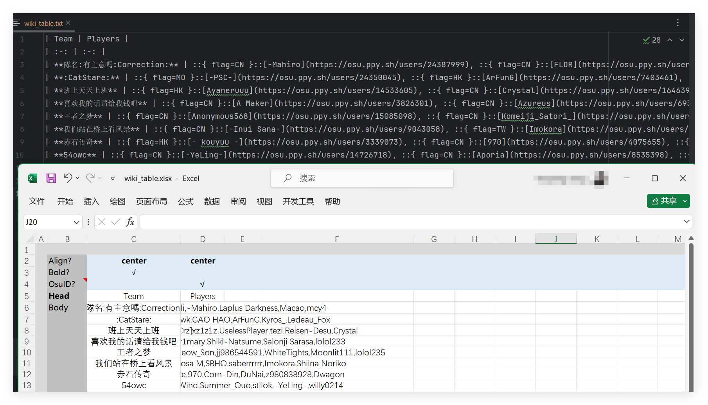
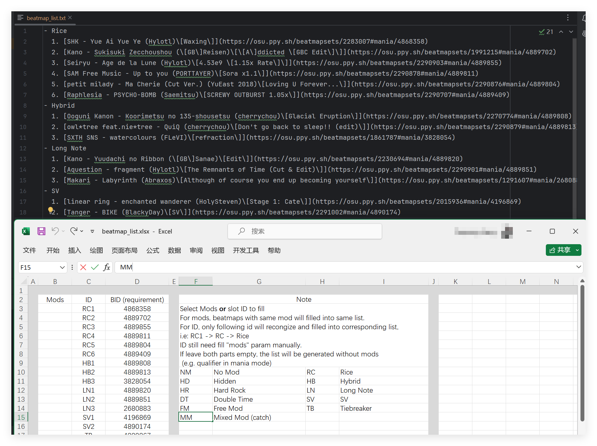

# Osu-wiki-write-utils
This repo contains some tools to generate some parts for osu wiki, contain following tools:
- Table generator
- Beatmap list generator

This repo mainly use [Ossapi](https://github.com/tybug/ossapi) by [tybug](https://github.com/tybug)，thanks you! 

## Setting API token

1. Go OAuth in [osu! website settings](https://osu.ppy.sh/home/account/edit)

2. Create an OAuth application or using an exist one, copy Client ID and Client secret.

3. Paste to `.env`, don't forgot using `""` to contain string, like `"14015"`

## Table generator

### Usage

1. Filling sheets in `data\wiki_table.xlsx`.

2. Run `Table_generator.py`.

3. Go `output\wiki_table.txt` to see the result.

## Beatmaplist generator

### Usage

1. Filling sheets in `data\beatmap_list.xlsx`.

2. Run `Beatmaplist_generator.py`.

3. Go `output\beatmap_list.txt` to see the result.

Feel free to use [issues](https://github.com/RushFTK/Osu-wiki-write-utils/issues) page if anything feedback or improvement! ^^

